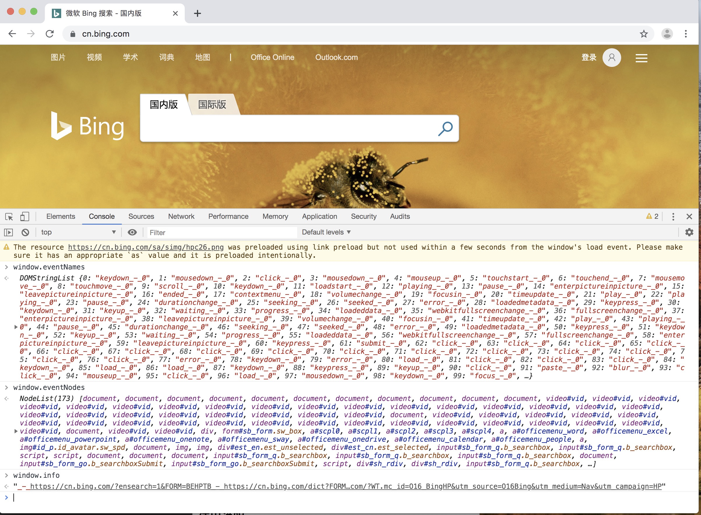

[中文版本(Chinese version)](./README.zh-cn.md)

## Core functions

By modifying the chromium source code, two functions that are more concerned about in two dynamic crawlers are mainly implemented:

1. The current page is prohibited from being redirected, and the URL to be redirected is collected for future use. This is achieved by modifying a relatively low-level function, and there is no need to hook in various scenarios.
2. Hook all non-default events bound by the current page and reserve the scene for subsequent triggers. This way the crawler does not need to traverse all DOM nodes.

There are also some small features:

1. Disable browsers from downloading files.
2. Ignore the "X-Frame-Options" header, which allows arbitrary pages to be iframed.
3. Prohibit alert, print, confirm, prompt popups.
4. Forbid the page to open a new window by itself; record the URL of the new window to be opened.
5. Kill the navigator.webdriver property.

## Download

Compiled finished product: https://github.com/myvyang/chromium_for_spider/releases

## Example

After opening the page, because the page jump is hooked, no matter how you click (or execute any JS), the page should not jump successfully. "URL to be redirected" will be recorded in `window.info`.

## Instructions for use

After implementing the core function by modifying the chromium source code, three properties have been added to the browser's `window` object:` window.info`, `window.eventNames`, and` window.eventNodes`.

Among them, `window.info` records the jump URL triggered in the page, etc., and uses` _-_ `to separate.

`window.eventNames` and` window.eventNodes` are used together, `eventNames` is the event name, such as` click`, `onmouseover`, etc.` eventNodes` is the DOM node bound to the event, which can be obtained through JS. See `ch_test / fireevent.html` for usage examples.

## Compile

The current (20190517) version of chromium used is `dbc6c805b7430f401875d50b8566d9f743ca402b`, and the test can be easily compiled successfully. It is possible that some of the dependencies of chromium will be invalidated over time. If it fails, please open an issue reminder to update the chromium version.

Today, the compilation of chromium is very simple. According to the official steps, choose the correct development version (such as `dbc6c805b7430f401875d50b8566d9f743ca402b` currently used), which can completely achieve no warning throughout the process.

See the official documentation: `https: // www.chromium.org / developers / how-tos / get-the-code`.

1. Install the official steps first, download the source code and prepare the environment.
2. `git checkout dbc6c805b7430f401875d50b8566d9f743ca402b` to switch to the specified version.
3. `gclient sync`, this step may report an error. If the error is a module of chromium, delete the module and continue executing this command.
4. `git apply path / to / dbc6c805b7430f401875d50b8566d9f743ca402b.diff` apply this patch.
2. `gn args out / Release` adds parameters in args.gn (optional, does not affect usability).
3. `gn gen out / Release` produces compiled files.
4. `autoninja -C out / Release chrome` starts to compile.

The executable file on Mac is `src / out / Release / Chromium.app / Contents / MacOS / Chromium`, and the executable file on Ubuntu is` src / out / Release / chrome`.
